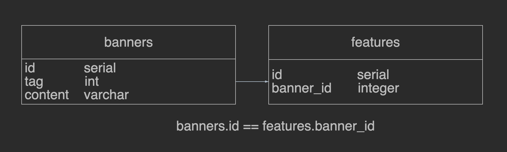

# [Avito Backend Trainee Project](https://github.com/avito-tech/backend-trainee-assignment-2024?tab=readme-ov-file)
You can find postman API docs [here](https://documenter.getpostman.com/view/30507430/2sA3BgAFUB).

## Some thoughts...
> Found out that it's possible to use codegenerators to parse `openapi.yml` file and generated handlers. But generated code was too strange and I decided to do it by myself....

> Decided to use two tables: banners and features; this allows us to have multiple features for single banner. Scheme is shown in a picture.  



> How to get 403 status for /user_banner...? Under these conditions probably when token is incorrect.

> Decided to use go-json module [[Benchmarks]](https://github.com/goccy/go-json?tab=readme-ov-file#benchmarks)

> No details provided about auth token generation. Let's agree that users & admins can obtain their API tokens in their account settings OR it's generated by superior service.

> Didn't make cache struct over db struct because only one method is cached.


## Commands
### Run
```shell
docker-compose up -d --build
```
### Generate JWT token
```shell
go run ./cmd/token/... ADMIN
or
go run ./cmd/token/... USER
```

### Test
```shell
make test
```
## Load testing
Load testing can be performed via Apache Bench. Results can be viewied inside `tests` directory.
```shell
make load-test
```
## Local run w/o postgres
```shell
make run
```

## TODO
- [x] REST API
- [x] PostgreSQL Tables
- [x] Implement SQL queries execution for:
    - [x] GET /user_banner
    - [x] GET /banner
    - [x] POST /banner
    - [x] PATCH /banner/{id}
        - [x] Check if id inside table
    - [x] DELETE /banner/{id}
        - [x] Check if id inside table
- [x] Implement users & admins auth via JWT
    - [x] Users auth
    - [x] Admins auth
- [x] Implement cache (Simple map cache)
    - [x] Add goroutine that clears cache every 5 mins
- [x] Add graceful shutdown
- [x] If banner is inactive then only admins can access it.
    - [x] Pass context with role for /user_banner to check if content should be shown
    - [x] Add is_active field to cache
- [x] Add logs
- [x] /user_banner tests
- [x] Add load tests
    - [x] Load testing command
    - [x] Add load testing results
- [x] Pack app into image and make docker compose file